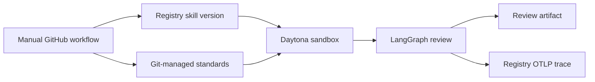

# Registry PR review demo

A generic, engineering-first demo of a GitHub PR-review agent governed by Atlan Registry.
GitHub remains the source of truth for the skill and engineering standards. Registry versions the
skill and provides the execution evidence. LangGraph guides the review, and Daytona is the only
execution environment for the live path.



## What the demo proves

- A skill can stay in GitHub while Registry gives it a stable identity and immutable versions.
- A PR review runs in an ephemeral Daytona sandbox with outbound networking blocked.
- LangGraph makes the review stages visible and repeatable.
- The trace records the skill name, version, source digest, referenced documents, decision, and
  finding count. It never records the raw diff or document contents.
- The GitHub workflow is manual and read-only. It produces an artifact for human review; it does
  not post back to the pull request automatically.

Everything in this repository is synthetic. There are no customer names, repositories, rules,
credentials, or production identifiers.

## Repository layout

```text
skills/secure-pr-review/       Git-authored Registry skill
knowledge/                     Synthetic engineering standards
src/registry_pr_review_demo/   Registry, Daytona, LangGraph, and OTLP adapters
examples/                      Safe and blocking PR diffs
registry/                      Desired Registry state and verified live ids
scripts/                       Non-printing credential and Daytona helpers
tests/                         Deterministic unit and boundary tests
```

## Documentation

- [Architecture](docs/architecture.md)
- [Trace-driven improvement loop](docs/trace-improvement-loop.md)
- [API contracts](docs/api-contracts.md)
- [Live runbook](docs/runbook.md)
- [Registry inventory](docs/registry-inventory.md)

## Local verification

Requires Python 3.12 and `uv`.

```bash
uv sync --locked
uv run ruff format --check .
uv run ruff check .
uv run pyright
uv run pytest
```

The tests use fakes for Daytona and Registry. They do not need credentials or make network calls.

## Live demo setup

Store these credentials only through the Keychain and Daytona Secret helpers:

- `ATLAN_API_KEY`
- `DAYTONA_API_KEY`

The non-secret runtime coordinates are fixed by the local configuration:

- `ATLAN_REGISTRY_URL`
- `ATLAN_WORKSPACE_ID`

No secret value belongs in this repository, workflow arguments, logs, or review artifacts.

1. Follow the [live runbook](docs/runbook.md) to create the Daytona account and store the key.
2. Publish both skills and register the approved Data workspace objects.
3. Run the SDK reviewer and CLI improvement agent, then inspect the traces in Registry.

Publishing and the live review are real external operations. They are deliberately local and manual.
Authenticated Registry read-back is still required before presenting trace delivery as verified.

The later AtlanAI repository phase will add reviewed GitHub workflows. This local phase intentionally
contains no CI workflow or remote-provenance claim.

## Runtime boundary

The controller resolves the pinned skill bundle and allowlisted Git knowledge before starting the
sandbox. Daytona receives only the bounded job JSON and a zipapp containing the review worker. The
sandbox installs pinned LangGraph `1.2.11`, blocks outbound networking, executes a fixed command,
and is deleted in a `finally` path.

The deterministic rules in `rules.json` make the demo reproducible. A model-backed LangGraph node
can replace `inspect_diff` later, but customer or proprietary code must not be sent to an external
model without an approved data path.
