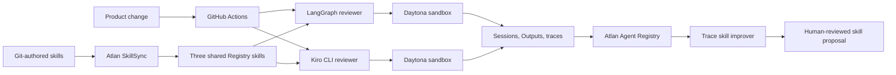

# Software Factory

[](https://github.com/atlanai/software-factory-demo/actions/workflows/software-factory-review.yml)
[](https://github.com/atlanai/software-factory-demo/actions/workflows/atlan-skill-sync.yml)
[](https://github.com/atlanai/software-factory-demo/actions/workflows/kiro-daytona-review.yml)

This repository is a working software factory. Product code, review agents, engineering skills,
runtime policy, evaluation cases, CI evidence, and Registry lineage all live in one inspectable Git
history. GitHub owns change. Atlan Agent Registry owns identity and versions. Daytona supplies the
ephemeral runtime. LangGraph and Kiro CLI provide two independent implementations of the same
governed review contract.

The factory currently reviews a proposed change to a synthetic order service. The shipped service
uses parameterized SQL. The proposed patch introduces dynamic evaluation and interpolated SQL, so
the governed review returns `changes_requested` without applying the patch.

## Open the factory

| Surface | What to inspect |
|---|---|
| [Product software](software/order-service/) | Safe order-service code and its focused test |
| [PR review agent](agents/pr-review-agent/) | LangGraph entrypoint, immutable Registry identity, Daytona environment |
| [Kiro PR review agent](agents/kiro-pr-review-agent/) | Headless Kiro implementation with read/grep-only authority |
| [Trace improver](agents/trace-improver/) | Proposal-only agent that learns from version-scoped traces |
| [Secure review skill](skills/secure-pr-review/) | Git-authored policy published to Registry |
| [Test impact skill](skills/test-impact-analysis/) | Maps changed behavior to focused regression coverage |
| [Evidence summary skill](skills/review-evidence-summary/) | Enforces the shared machine-readable result contract |
| [Improvement skill](skills/trace-driven-skill-improvement/) | Trace contract and bounded patch logic |
| [Factory control plane](factory/) | Proposed change fixture and deterministic review inputs |
| [Software Factory Review](https://github.com/atlanai/software-factory-demo/actions/workflows/software-factory-review.yml) | Tests, governed review, trace submission, evidence artifact |
| [Atlan SkillSync](https://github.com/atlanai/software-factory-demo/actions/workflows/atlan-skill-sync.yml) | Protected-branch publication from GitHub to Registry |
| [Demo control room](docs/demo-links.md) | GitHub, Registry, trace, agent, and Daytona links in one place |
| [Registry inventory](docs/registry-inventory.md) | Verified live IDs, traces, Outputs, and governance status |

## The factory loop



Nothing in the improvement loop edits or publishes a skill automatically. A trace can produce a
proposal; a human still owns the policy change and the merge.

## What runs in CI

`Software Factory Review` runs on every relevant push and on demand:

1. Install the locked Python environment.
2. Test the order service.
3. Run formatting, lint, type, and unit-test gates for the factory.
4. Feed `factory/fixtures/risky-order-change.diff` to the LangGraph review agent.
5. Resolve `secure-pr-review` with its Registry fingerprint.
6. Produce a Markdown summary and machine-readable review artifact.
7. Submit an Atlan trace when `ATLANAI_TOKEN` is configured.

`Kiro PR Review in Daytona` is an independent manual acceptance lane. It downloads only the pinned
Kiro 2.20.1 archive, verifies both archive and launcher SHA-256 values, uploads the synthetic service,
diff, exact skill bundles, custom-agent policy, and trace worker to Daytona, then runs Kiro with only
`read` and `grep`. The run fails if Agent identity, skill fingerprints, structured output, Session,
Output, or Agent/Skill trace readback is incomplete.

`Sync skills to Atlan` is a separate least-privilege workflow. It publishes only from `main` and
uses full Git history for provenance. Until v0.1.2 is merged, both workflows pin the signed
`fix/installer-digest-v0.1.2` commit rather than a moving branch name. Pull requests get a
credential-isolated Registry preflight comment; PR code never receives the publishing credential.
Add the repository secret `ATLANAI_TOKEN` to enable publication; without it, the workflow reports
that it is ready but uncredentialed and exits without publishing.

## Repository map

```text
software/order-service/                  Product code under review
agents/pr-review-agent/                  LangGraph reviewer definition
agents/kiro-pr-review-agent/             Kiro CLI reviewer definition
agents/trace-improver/                   Trace-driven proposal agent
skills/secure-pr-review/                 Governed review policy
skills/test-impact-analysis/             Focused regression-test planning
skills/review-evidence-summary/          Shared review result contract
skills/trace-driven-skill-improvement/   Governed improvement policy
factory/fixtures/                        Proposed changes used as evidence
knowledge/                               Engineering standards referenced by skills
src/registry_pr_review_demo/             Runtime, Registry, Daytona, and trace adapters
registry/                                Desired state and verified artifact references
docs/                                    Architecture, API contracts, runbook, diagrams
.github/workflows/                       Review, SkillSync, and preflight automation
```

## Live evidence

The checked-in [Registry inventory](docs/registry-inventory.md) records the currently verified
workspace objects. The demo evidence includes:

- Daytona sandbox `ceeffd99-d723-4d88-89bd-b1052b025bf7` running both LangGraph agents.
- Reviewer trace `06cd432f9c7c5e182c896fcc969b12d4` with the `secure-pr-review` fingerprint.
- CLI improver trace `9e916c9e533d518e6a277bf7a4aa5761` with a bounded false-negative proposal.
- Source Output `output_01m11hwbd5eqg8kz4mhhd1cp3w` and evidence Output
  `output_01m11hsqegem09jfatqr5w5p45` in the Data workspace.

The source diff never enters telemetry. Traces carry the evaluation ID, skill name, version,
digests, decision, finding count, and matched rule IDs.

## Run locally

Requires Python 3.12 and `uv`.

```bash
uv sync --locked
uv run python -m unittest discover software/order-service/tests
uv run ruff format --check .
uv run ruff check .
uv run pyright
uv run pytest
uv run python -m registry_pr_review_demo.factory_review \
  --diff factory/fixtures/risky-order-change.diff \
  --output build/factory-review/review.json \
  --summary build/factory-review/summary.md
```

The expected review decision is `changes_requested`. The risky patch remains a fixture; the product
code stays safe.

## Design boundaries

- Daytona receives a bounded synthetic workspace, not Git credentials or the full repository.
- Kiro has no shell, write, Git mutation, web, or MCP authority.
- Runtime egress is an explicit host allowlist; wildcard internet access is disabled.
- GitHub pull-request code never receives the Registry publishing credential.
- Every Daytona run requires its registered Agent key; missing identity fails before execution.
- Registry traces omit raw diffs, file contents, unrestricted model output, and credentials.
- Agent output is advisory. A human owns merges and skill publication.

See [architecture](docs/architecture.md), [trace improvement loop](docs/trace-improvement-loop.md),
[API contracts](docs/api-contracts.md), and the [live runbook](docs/runbook.md) for the detailed path.
