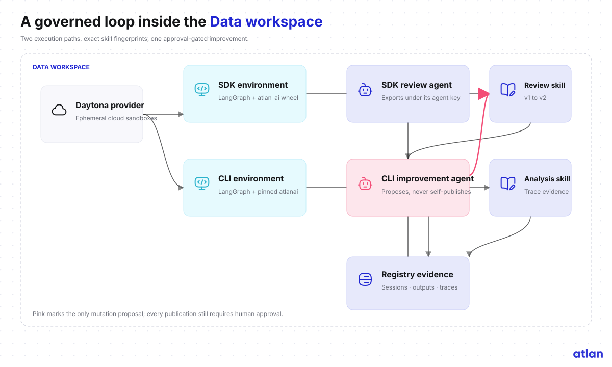

# Architecture

The factory executes the same synthetic risky patch through two independent reviewers: LangGraph
and headless Kiro CLI. Both run in ephemeral Daytona sandboxes, use the same three Git-authored
Registry skills, authenticate as distinct Atlan Agents, and emit separately attributable evidence.



## Trust boundaries

The local checkout is the source of truth for both skills, the evaluation cases, and the synthetic
knowledge documents. Registry is the source of truth for published skill versions, agent identity,
sandbox declarations, sessions, outputs, relationships, and trace readback. Daytona executes the
three agents but owns none of those definitions.

Secrets cross only two boundaries:

- The host Daytona API key lives in macOS Keychain and is consumed by the Daytona SDK.
- Each Registry agent API key lives in macOS Keychain and in one host-restricted Daytona Secret.

The repository, command arguments, result files, documentation, and Registry state file contain no
credential values.

## Registered objects

All objects live in the Data workspace `workspace_01m0g43eb2fmgbv21dc7ygs7rc`.

| Kind | Stable name | Purpose |
|---|---|---|
| Agent framework | `langgraph` | Existing seeded framework; reused, not recreated |
| Agent framework | `kiro-cli` | Registered framework for headless custom agents |
| Agent provider | `daytona` | Catalog entry for the external sandbox service |
| Environment | `daytona-sdk-pr-review` | LangGraph plus internal `atlan_ai` wheel |
| Environment | `daytona-cli-skill-improver` | LangGraph plus checksum-pinned Linux `atlanai` |
| Environment | `daytona-kiro-pr-review` | Pinned Kiro launcher plus internal `atlan_ai` wheel |
| Agent | `pr-review-agent` | Local alias for the immutable LangGraph Agent ID |
| Agent | `kiro-pr-review-agent-api` | API-created read-only Kiro reviewer with structured JSONL output |
| Agent | `registry-skill-improver-cli` | Reads Registry traces, proposes a patch, exports through CLI |
| Skill | `secure-pr-review` | Versioned review policy and deterministic rules |
| Skill | `test-impact-analysis` | Focused affected-test and regression-gap analysis |
| Skill | `review-evidence-summary` | Validated decision, findings, skills, and test-plan contract |
| Skill | `trace-driven-skill-improvement` | Evidence analysis and approval-gated improvement workflow |

The agents are peers. Both review agents use the same three review skills. The improver uses
`trace-driven-skill-improvement`; none is registered as another agent's sub-agent.

## Execution packages

The SDK agent image installs:

- Python 3.12;
- `langgraph==1.2.11`;
- the checksum-verified internal `atlan_ai==0.1.0` wheel;
- the review worker zipapp.

The CLI agent image installs Python and LangGraph, then embeds `atlanai` 0.3.53 for Linux AMD64.
The binary is downloaded from Atlan's signed preview manifest and checked against
`2de549a7f584f748f8e082e7c88b18a0e916ef3051f06be2aeddfefa6b13ea59` before use.

The Kiro sandbox embeds the verified 2.20.1 Linux launcher. Archive and launcher digests are pinned
in `vendor/kiro/manifest.json`; the official installer is never piped to a shell. Kiro receives only
`read`, `grep`, and the read-only `disclose_context` skill activator. The pinned `atlanai` CLI in that same sandbox converts the sanitized result into
OTLP JSON and submits it through `POST /otel/v1/traces`. All sandboxes are ephemeral and every exit
path deletes them.

## Attribution

LangGraph uses its Registry Agent key as `ATLAN_API_KEY` through the Atlan Python SDK. Kiro maps its
Agent key to both `ATLAN_API_KEY` for Session/Output REST calls and `ATLANAI_TOKEN` for the CLI trace
submission. Gateway-authenticated identity therefore scopes each agent trace; an arbitrary
payload attribute cannot claim another agent.

The skill invocation span carries the exact Registry fingerprints:

```text
atlan.skill.name
atlan.skill.version
atlan.skill.source_digest
atlan.skill.skillmd_sha256
atlan.skill.fingerprint_source=registry
atlan.registry.skill.version_ordinal
```

Each review creates a Registry Session and linked Output after trace export. Completion requires
readback through the Agent trace facade and every used Skill trace facade. Raw diffs and knowledge
contents are not stored in the trace. The evaluation case id, expected decision, actual decision,
finding count, and matched rule ids are enough to diagnose the synthetic failure.

## Storage and readback

OTLP ingest acknowledges durable handoff before asynchronous ClickHouse projection. Verification
therefore distinguishes three states: ingest accepted, projected trace found, and subject/skill
facade attribution confirmed. A two-minute bounded poll handles projection lag; expiry is reported
as partial verification rather than silently retried forever.
