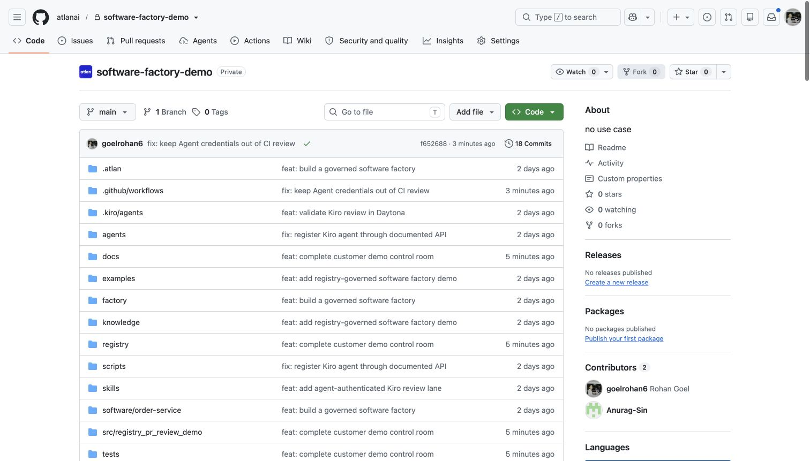
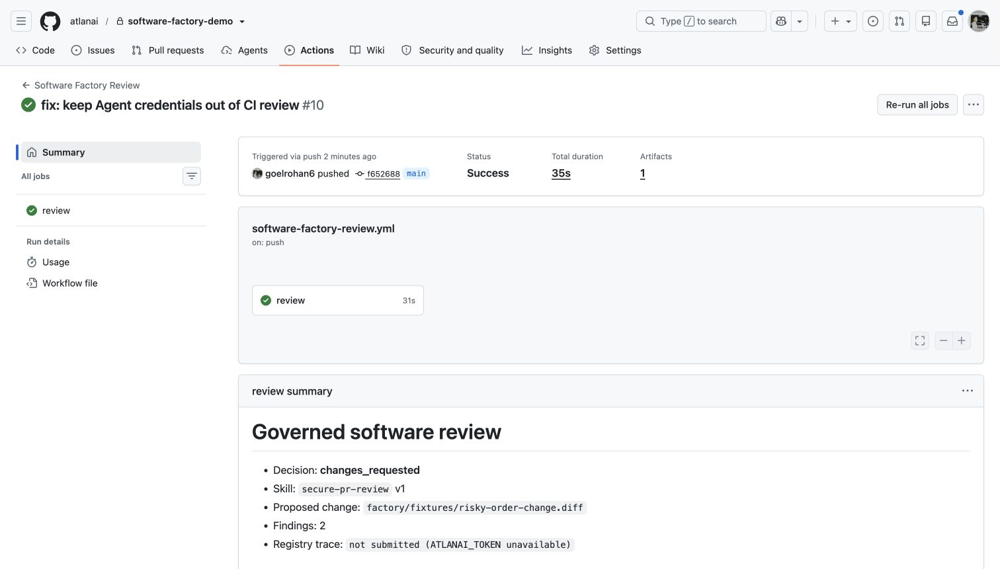
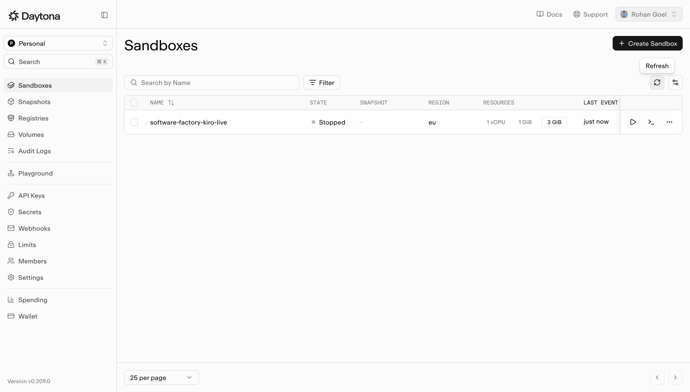
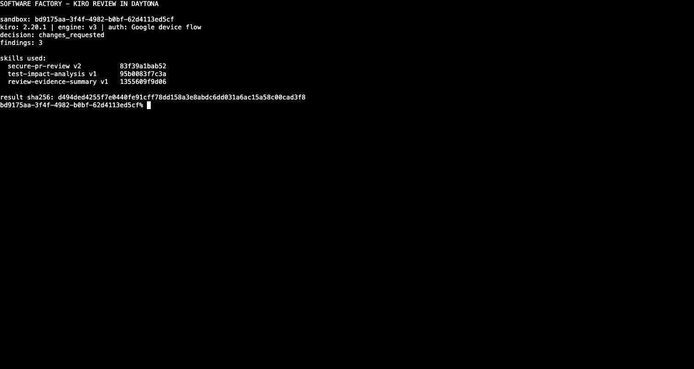

# Customer demo: governed software factory

This walkthrough tells one story: a software change enters GitHub, two independent reviewers apply
the same governed skills inside Daytona, and Atlan ties the code, Agent identities, skill versions,
and runtime evidence together.

The repository is customer-neutral. The product under review is a synthetic order service; no
customer code, tenant names, or production data appear in the demo.

## What the customer should believe

GitHub remains the source of change. Atlan registers who and what is allowed to review that change.
Daytona provides the isolated execution boundary. LangGraph and Kiro can use different agent
implementations without drifting from the same review policy.

The proof is inspectable:

- product code and the proposed patch are separate;
- three Git-authored skills have immutable Registry IDs and digests;
- each Agent has its own machine identity and the same three `uses_skill` relationships;
- the Kiro and LangGraph runtime paths fail closed when identity or telemetry is incomplete;
- the trace-improvement Agent proposes changes but cannot publish them.

## Presenter preflight

Open these tabs before the call. Keep them in this order.

1. [Repository home](https://github.com/atlanai/software-factory-demo)
2. [Order-service code](https://github.com/atlanai/software-factory-demo/tree/main/software/order-service)
3. [Risky proposed diff](https://github.com/atlanai/software-factory-demo/blob/main/factory/fixtures/risky-order-change.diff)
4. [Shared skills](https://github.com/atlanai/software-factory-demo/tree/main/skills)
5. [LangGraph Agent](https://github.com/atlanai/software-factory-demo/tree/main/agents/pr-review-agent)
6. [Kiro Agent](https://github.com/atlanai/software-factory-demo/tree/main/agents/kiro-pr-review-agent)
7. [SkillSync workflow](https://github.com/atlanai/software-factory-demo/actions/workflows/atlan-skill-sync.yml)
8. [Daytona sandboxes](https://app.daytona.io/dashboard/sandboxes)
9. [PR Review Agent in Atlan](atlan://open/orgs/atlan-prod/brain/agent/agent_01m1ejp36efnsrw6m8w20atdr3)
10. [Kiro PR Review Agent in Atlan](atlan://open/orgs/atlan-prod/brain/agent/agent_01m1ejp2w6fy0synanm0qp4akh)
11. [Secure PR Review skill](atlan://open/orgs/atlan-prod/brain/skill/skill_01m11gr8cjekhb5gvqn0k4x1ny)
12. [Test Impact Analysis skill](atlan://open/orgs/atlan-prod/brain/skill/skill_01m1a58e1kfx8aq721tnwd8zgm)
13. [Review Evidence Summary skill](atlan://open/orgs/atlan-prod/brain/skill/skill_01m1a4yhyaey88ykf2ht4qrvc9)

## The story, one tab at a time

### 1. Start with the factory, not the Registry

Open the repository home. Point out the top-level folders before discussing Agents:

```text
software/   the product being changed
factory/    the proposed change and evaluation inputs
skills/     versioned engineering policy
agents/     independent implementations
registry/   immutable IDs and resolved fingerprints
docs/       operating model and demo evidence
```

Say: “This is an ordinary software repository with an AI review layer, not an AI showcase with
some sample code attached.”



### 2. Show the safe product surface

Open `software/order-service`. The checked-in repository uses parameterized SQL and has a focused
repository test. Nothing in the demo mutates this code.

Then open `factory/fixtures/risky-order-change.diff`. The proposed patch introduces dynamic
evaluation and interpolated SQL. This is the controlled input both Agents review.

Ask the customer what they would want a reviewer to catch. Do not reveal the expected decision yet.

### 3. Show policy as code

Open the three review skills:

- `secure-pr-review` catches unsafe execution, interpolated SQL, and hardcoded credentials;
- `test-impact-analysis` maps changed behavior to focused regression coverage;
- `review-evidence-summary` defines the exact output contract shared by both Agents.

Each skill has a Registry ID, semantic version, source digest, and `SKILL.md` digest in
`registry/skill-references.json`. A runtime that reports another fingerprint fails the run.

### 4. Compare the two Agent implementations

Open the LangGraph Agent first. It is deterministic: load governed context, inspect the diff, and
decide. The Atlan SDK creates the root review span and the three skill spans.

Open the Kiro Agent next. Its custom-agent policy grants only `read`, `grep`, and Kiro's internal
`disclose_context` tool. It has no shell, write, Git mutation, web, or MCP authority. Kiro's JSONL
events are sanitized before they become trace evidence.

The point is not that one framework wins. The point is that both implementations remain inside one
governance and evidence contract.

### 5. Show how Git publishes policy

Open the SkillSync workflow. It runs from `main`, checks out full Git history, and uses the Atlan
Agent Registry Action. The workflow is pinned to the reviewed commit on
`fix/installer-digest-v0.1.2`; it does not follow a moving branch at runtime.

The publishing token is available only to the protected sync job. Pull-request code gets a
credential-isolated preflight.

The separate Software Factory Review lane is green and publishes a governed review artifact. It
does not receive an Agent key or submit telemetry.



### 6. Show the execution boundary

Open Daytona. The dashboard is the provider evidence: sandboxes are created from reviewed images,
receive a bounded synthetic workspace, and have explicit lifecycle limits.



The earlier Kiro acceptance run produced `changes_requested`, three findings, and all three exact
skill fingerprints inside Daytona:



That screenshot is historical acceptance evidence from 30 August 2026. Its sandbox has since been
deleted. Do not present it as a currently running sandbox.

The current acceptance sandbox is `software-factory-kiro-acceptance-4`
(`56050dee-0103-43d3-82a9-5b1c73bf2d88`). Open its terminal only to show the bounded environment;
do not expose the stored JSONL stream or authentication state.

### 7. Open each Agent in Atlan

Open the PR Review Agent, then the Kiro PR Review Agent. On each profile:

1. show the immutable Agent ID;
2. open Relationships;
3. verify the three active `uses_skill` edges;
4. open Sessions and Usage;
5. open a trace only when a completed live acceptance run is present.

The final demo identities are:

| Runtime | Agent ID | Framework |
|---|---|---|
| LangGraph | `agent_01m1ejp36efnsrw6m8w20atdr3` | `agent_framework_01m09v3ncvey0a4ndx008we9kr` |
| Kiro CLI | `agent_01m1ejp2w6fy0synanm0qp4akh` | `agent_framework_01m1a5cq3hfdg88xkbwpz4w807` |

Both API keys resolve through the Atlan CLI as the correct machine principal with
`contextplane:read` and `contextplane:write` scopes. The keys are not in GitHub Secrets or the
repository.

### 8. Close on the improvement loop

Open `agents/trace-improver` and `skills/trace-driven-skill-improvement`. The improver reads a
version-scoped trace, classifies a missed finding, and writes a bounded proposal. It cannot change
the production skill or publish a new version. A human still reviews the patch and merges it in
GitHub.

Say: “The learning loop ends in a reviewable Git change, not an autonomous policy mutation.”

## Live acceptance status

Checked on 1 September 2026:

| Check | Result | Evidence |
|---|---|---|
| Final Agent creation | Pass | Both create calls returned HTTP 201 and reveal-once 90-day API keys |
| Agent machine identity | Pass | `atlanai auth status` and `registry:/auth/whoami` resolve the LangGraph key to its Agent ID |
| Shared skill relationships | Pass | Each final Agent has three active `uses_skill` relationships |
| Daytona Agent-secret mount | Pass | Daytona injects an opaque placeholder; the pinned Atlan CLI exchanges it without exposing plaintext |
| LangGraph execution in Daytona | Pass through review; telemetry blocked | Agent-authenticated OTLP ingest returns HTTP 503 `service_unavailable` |
| Kiro 2.20.1 runtime | Pass | Complete three-binary archive and individual SHA-256 values verified |
| Kiro Free device login in Daytona | Pass | Google/AWS device flow completed after the exact OIDC and Kiro hosts were allowlisted; no paid plan required |
| Kiro review result | Pass | `changes_requested`, 2 findings, and all 3 Registry skill fingerprints |
| Kiro Agent trace | Pass | Ordered trace `47fe8b2d2bc824962bb8a85c4b5e175e` verified through the Agent and all 3 Skill facades |
| Kiro Session and Output | Pass | Session `session_01m1fp7y6det9vzcdr2esvgcte` has 2 sanitized turns; Output `output_01m1fp7z1gewhvem8kqg9xmskf` links the GitHub run |
| Native Kiro Usage | Pass | Latest run shows instruction → prompt → 3 named Skills → response, `kiro-auto`, 5,291 tokens, and USD 0.006888 plan-equivalent cost |

Open the newer Session titled **Governed Kiro review with usage and cost**. It shows
two turns without raw code or diff content. An older zero-turn Session remains because the Session
API is append-only; do not use that historical row in the customer walkthrough.

## Recovery checklist before a customer call

1. Open the top two-turn Kiro Session and verify the sanitized request and response.
2. Open Kiro Usage, select the latest `software_factory.pr_review` run, and switch to **Full trace**.
3. Verify the three named Skill calls appear before the final response and open each fingerprint.
4. Explain that the displayed USD value is a Pro-plan-equivalent estimate; the Free-plan bill is USD 0.
5. Re-run the LangGraph lane and require `trace_id`, `session_id`, and `output_id` before adding it
   to the live walkthrough.

The Kiro lane is ready for the live walkthrough. Keep the LangGraph Usage tab out until its current
Agent-authenticated telemetry acceptance also passes.

## Useful links

- [Architecture](architecture.md)
- [API contracts](api-contracts.md)
- [Live runbook](runbook.md)
- [Registry inventory](registry-inventory.md)
- [Demo control room](demo-links.md)
- [Daytona Secrets behavior](https://www.daytona.io/docs/en/secrets/)
- [Kiro authentication](https://kiro.dev/docs/cli/authentication/)
- [Kiro firewall endpoints](https://kiro.dev/docs/privacy-and-security/firewalls/)
