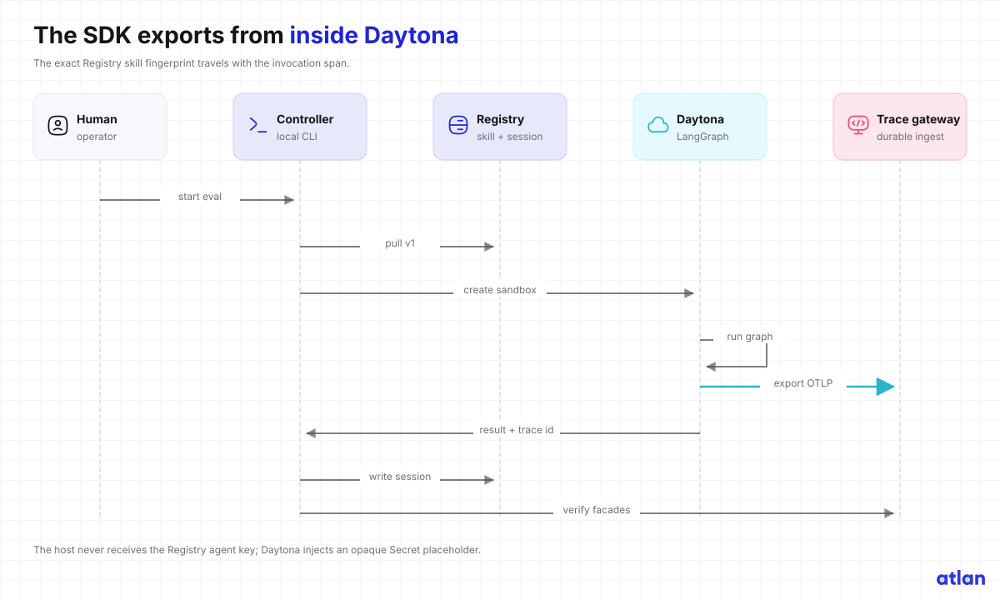
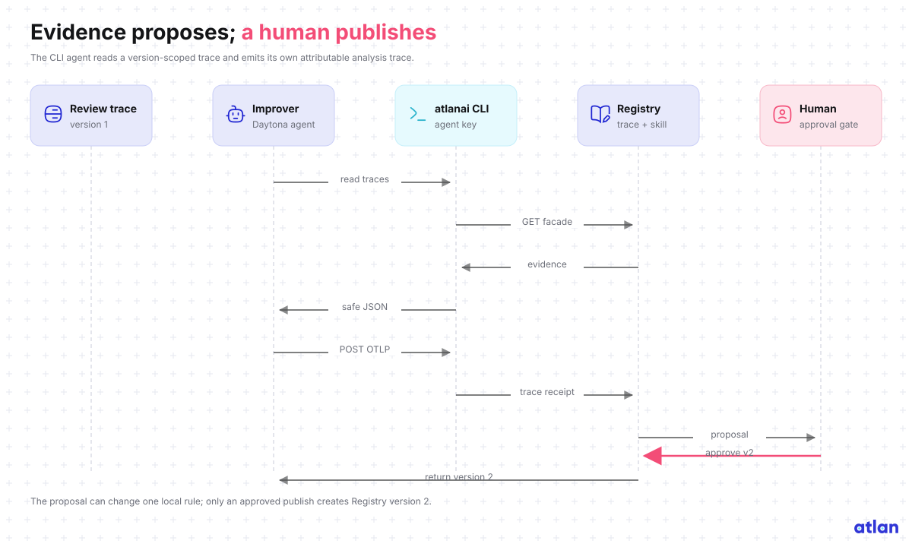

# Trace-driven improvement loop

The loop starts with a real failure. Version 1 detects Python f-string SQL but misses the equivalent
`.format(...)` construction in `examples/sql-format-gap.diff`.

## SDK review trace



The reviewer pulls the exact Registry skill version before creating the sandbox. Inside Daytona,
the Atlan SDK opens a task span and a fingerprinted `review.skill` child span. LangGraph runs the
review nodes under the SDK callback. The evaluation expects `changes_requested`; version 1 returns
`approve` and records zero findings.

The reviewer then uploads a Registry session whose `external_session_id` matches the SDK trace
session. This makes the run inspectable through the agent, session, and skill trace facades.

## CLI analysis trace



The improvement agent reads only the version-scoped skill trace and its sliced spans. It compares:

```text
demo.eval.expected_decision = changes_requested
review.decision             = approve
review.finding_count        = 0
```

The local evaluation fixture contains `SELECT ... .format(...)`. The current `parameterize-sql`
rule covers only f-string SQL, so the analyzer classifies a false negative and proposes one bounded
pattern change. It does not edit `rules.json`.

The analyzer emits its own two-span OTLP JSON document and submits it with authenticated
`atlanai api post /otel/v1/traces`. Its skill span carries the published fingerprint of
`trace-driven-skill-improvement`.

## Approval and version 2

The proposal contains the trace id, target rule, before/after patterns, and rationale. Publishing
stops until a human approves that exact patch.

After approval:

1. Apply the one-rule patch locally.
2. Run the full evaluation and quality gates.
3. Publish `secure-pr-review` as Registry version 2.
4. Rerun `sql-format-interpolation` unchanged.
5. Verify `changes_requested` and the exact version 2 fingerprint.
6. Preserve the version 1 trace, proposal, version 2 trace, and readback report as separate Outputs.

No trace or proposal can publish a skill version by itself.

